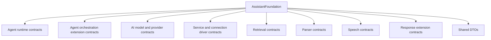

# AssistantFoundation Overview

## Purpose

This document gives a map of AssistantFoundation and explains which public contract family should be used for a given assistant or AI integration problem.

AssistantFoundation is implementation-light by design. Its primary job is to make plugin boundaries explicit and stable.

## High-level map

## Choosing the correct contract

Use `IAgentExecutionService` when a consumer wants to execute whichever agent runtime is configured.

Use `IAgentRuntimeService` when implementing a named runtime that AssistantRuntime can discover.

Use `IAgentConversationService` for explicit conversation lifecycle operations and `IAgentTextTaskService` for isolated model-oriented tasks that do not represent a normal conversation turn.

Use `IAgentStage`, `IAgentModule`, `IAgentCapabilityProvider`, or `IAgentContextContributor` when adding discoverable agent behavior to a runtime that supports those extension surfaces.

Use `IAiChatModel`, `IAiEmbeddingModel`, or `IImageGenerationModel` when implementing a provider adapter.

Use `IServiceDriverDefinition` when describing how a configured service record maps to one discoverable implementation class.

Use `IRetrievalIndex` for storage/retrieval operations and `IRetrievalCollectionDefinition` for domain-owned collection semantics.

Use `IFileParserService` for configured file/document parser backends.

Use the speech service contracts for complete STT/TTS operations and realtime session creation.

## What does not belong here

AssistantFoundation should not contain:

* final provider selection;
* MissionBay flow factories;
* MissionBay node/resource implementations;
* concrete SettingsStore records;
* admin displays that belong to one runtime;
* Qdrant, OpenAI, Mistral, or parser transport logic;
* project-specific credentials;
* host-specific runtime wiring.

## Stability rule

An interface in AssistantFoundation is a plugin-to-plugin contract. Adding or changing it affects all runtime and consumer plugins that implement or consume it.

Before adding a new interface, first ask whether an existing contract already owns the boundary. Do not introduce a second profile, routing, state, or runtime mechanism to compensate for a missing method in the correct contract.

## Related documents

See the package [readme](../readme.md) and the thematic documents in this directory.
